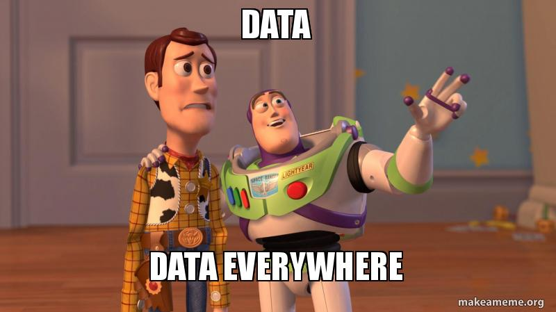
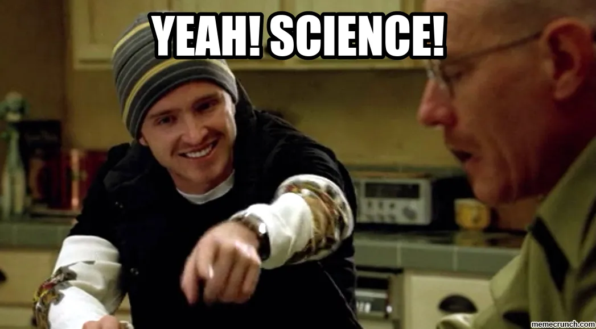
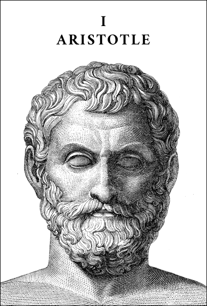
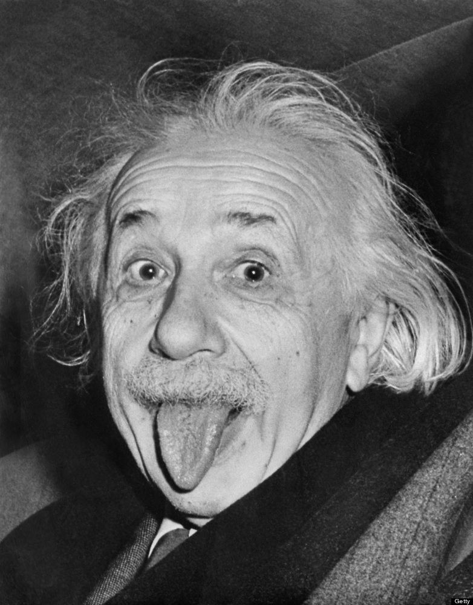
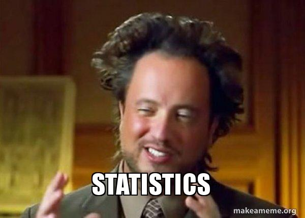

class: animated, fadeIn
layout: true

<!-- Global site tag (gtag.js) - Google Analytics -->
<script async src="https://www.googletagmanager.com/gtag/js?id=UA-186284914-5"></script>
<script>
  window.dataLayer = window.dataLayer || [];
  function gtag(){dataLayer.push(arguments);}
  gtag('js', new Date());

  gtag('config', 'UA-186284914-5');
</script>

---
```{r setup, include=FALSE}
library(ggplot2)
library(magrittr)
library(DiagrammeR)
library(countdown)
library(gtsummary)
options(htmltools.dir.version = FALSE,
        htmltools.preserve.raw = FALSE)
knitr::opts_chunk$set(fig.retina = 4,
                      warning = FALSE,
                      message = FALSE,
                      echo = FALSE)
theme_gtsummary_language("pt")
set.seed(123)
```

```{r xaringan-themer, include=FALSE, warning=FALSE}
library(xaringanthemer)

extra_css <- list(
  ".tiny" = list("font-size" = "40%"),
  ".small" = list("font-size" = "70%"),
  ".large" = list("font-size" = "130%"),
  ".xlarge" = list("font-size" = "200%"),
  ".full-width" = list(
    display = "flex",
    width   = "100%",
    flex    = "1 1 auto"
  ),
  "white" = list("color" = "white !important")
)

# UNINOVE Colors
style_mono_accent(
  base_color = "#29427A",
  header_font_google = google_font("Josefin Sans"),
  text_font_google   = google_font("Montserrat", "300", "300i"),
  code_font_google   = google_font("Fira Mono"),
  text_font_size     = "1.5em",
  footnote_font_size = "0.4em",
  extra_css = extra_css,
  outfile = "css/xaringan-themer.css"
)
```

```{r xaringan-logo, echo=FALSE}
# xaringanExtra tile view press key "O"
xaringanExtra::use_tile_view()

xaringanExtra::use_logo(
  image_url = "https://raw.githubusercontent.com/storopoli/UNINOVE-xaringan-theme/master/resources/uninove.png",
  link_url = "https://www.uninove.br",
  width = "110px",
  height = "55px")

xaringanExtra::use_fit_screen()
#xaringanExtra::use_animate_css()
xaringanExtra::use_tachyons()

# xaringanExtra webcam press key "W"
xaringanExtra::use_webcam()
```

# Na sua tela ultimamente ...

.pull-left[
```{r corona1, out.width='100%'}

```

]

.pull-right[
```{r corona2, out.width='100%'}

```
]

???

O modelo de risco proporcional de Cox se baseia numa função de sobrevivência e um conjunto de covariáveis $h(t)=h_{0}(t) \times \exp \left\{b_{1} x_{1}+b_{2} x_{2}+\cdots+b_{p} x_{p}\right\}$. Onde $h_0$ é o risco basal, que é estimada de maneira não-paramétrica (diferente de outros modelos estatísticos), portanto a assume-se que a sobrevivência não segue uma distribuição estatística particular. O modelo de Cox é essencialmente uma regressão linear múltipla do logaritmo do risco das variáveis $x_i$, com o risco basal sendo uma "constante" que varia com o tempo. As covariáveis, então, agem multiplicativamente sobre o risco em qualquer ponto no tempo, e isso nos fornece a suposição-chave do modelo PH: o risco do evento em qualquer grupo é um múltiplo constante do risco em qualquer outro.

---
# O que vamos falar hoje?

--
.pull-left[
### Literacia de Dados
* O que são dados?
* Dados Abertos

### Como a ciência avança?
* Método Científico
* Hierarquia de Evidências
]

--
.pull-right[
### Estatística
* Descritiva
* Inferencial

### Hipótese Nula
### $p$-valores
]

---
class: inverse, middle

# Literacia de Dados

```{r data_everywhere, out.width='100%'}

```


---
#  Literacia de Dados

**Definição da Wikipedia**:

.washed-blue.bg-blue.b--navy.ba.bw2.br3.shadow-5.ph4.mt5[
"capacidade de <u>ler</u>, <u>gerenciar</u>, <u>analisar</u> e <u>argumentar</u> por meio de <u>dados</u> (...) requer certas habilidades que envolvem a <u>leitura e a compreensão de dados</u>, também conhecidos como informações"
]

.footnote[[Wikipedia - Alfabetização de Dados](https://pt.wikipedia.org/wiki/Alfabetização_de_dados).]

---
# O que são Dados?

**Definição da OCDE**:

.washed-blue.bg-blue.b--navy.ba.bw2.br3.shadow-5.ph4.mt5[
Dados são <u>características</u> ou <u>informações</u>, geralmente numéricas, <u>coletadas por meio de observação</u> sobre uma ou mais pessoas ou objetos.
]

.footnote[Traduzido de: **OECD** - Glossary of Statistical Terms. OECD. 2008. p. 119. ISBN 978-92-64-025561.]

---
# Dados Abertos

```{r osf_example, out.width='45%', fig.align='center'}
knitr::include_graphics("images/osf_example.png", dpi = 300)
```

.footnote[[Repositório de dados da OSF](https://osf.io/ypbf6/) do artigo: Storopoli, J., da Silva Neto, W. L. B., & Mesch, G. S. (2020). Confidence in social institutions, perceived vulnerability and the adoption of recommended protective behaviors in Brazil during the COVID-19 pandemic. Social Science & Medicine, 265, 113477.]

---
# Dados Abertos

.pull-left[
[Agência FAPESP](https://agencia.fapesp.br/historico-de-atividade-fisica-nao-interfere-no-prognostico-de-casos-graves-de-covid-19/35048/)

```{r ag-fapesp-news}
knitr::include_graphics("images/ag-fapesp-news.png")
```
]

.footnote[
Pinto, A. J., Goessler, K. F., Fernandes, A. L., Murai, I. H., Sales, L. P., Reis, B. Z., ... & Gualano, B. (2020). No associations between physical activity and clinical outcomes among hospitalized patients with severe COVID-19. medRxiv.
]

--
.pull-right[
[medRxiv](https://www.medrxiv.org/content/10.1101/2020.11.25.20237925v1)

```{r ag-fapesp-full}
knitr::include_graphics("images/ag-fapesp-full.png")
```
]


---
# Onde encontrar dados?

--
.pull-left[
[`Brasil.io`](https://brasil.io/datasets/)

```{r brasil-io}

```
]

--
.pull-right[
[`juliohm/awesome-brazil-data`](https://github.com/juliohm/awesome-brazil-data)

```{r awesome-brasil-data}

```
]

---
class: inverse, middle, center
# Como a ciência avança?

```{r science, out.width='80%'}

```

---

# Como a Ciência Avança?

**Método Científico Hipótetico Dedutivo**

```{r graph-hipotetico-dedutivo, out.width='100%'}
grViz("
 digraph hipotetico_dedutivo {
  forcelabels = true;
  graph [overlap = false,
         fontsize = 12,
         rankdir = TD]
  node [shape = oval,
        fontname = Helvetica]
  A [label = 'Teoria']
  B [label = 'Realidade']
  A -> B [dir = forward,
          xlabel = 'Hipóteses ',
          tailport = 'e',
          headport = 'e']
  B -> A [dir = backward,
          xlabel = 'Predições ',
          tailport = 'w',
          headport = 'w']
} 
")
```

.footnote[[Wikipedia - Método hipotético-dedutivo](https://pt.wikipedia.org/wiki/Método_hipotético-dedutivo).]

---
class: center, middle
# Método Científico

<video width="600" height="400" controls>
  <source src="images/feynman.mp4" type="video/mp4">
</video>

.footnote[[Richard Feynman](https://en.wikipedia.org/wiki/Richard_Feynman) - Universidade de Cornell, 9 de Novembro de 1964]

---
# Teoria vs Realidade

.washed-blue.bg-blue.b--navy.ba.bw2.br3.shadow-5.ph4.mt5[
Se sua teoria discordar da realidade, sua teoria está errada. Não importa o quão bela ela é, o quão inteligente você é, quem você é. Se ela discorda da realidade ela está errada!
]

.footnote[[Richard Feynman](https://en.wikipedia.org/wiki/Richard_Feynman) - Universidade de Cornell, 9 de Novembro de 1964]

---
# Teoria vs Realidade

.pull-left[
Objetos pesados caem mais rápido que objetos leves.

```{r aristotle, out.width='60%'}

```
]

--
.pull-right[
```{r galileo_pisa, out.width='70%'}
knitr::include_graphics("images/galileo_pisa.jpg")
```
]

---
# Teoria vs Realidade

.pull-left[
A gravidade afeta não só a materia mas também a luz.

```{r einstein, out.width='50%'}

```
]

--
.pull-right[
```{r einstein_eclipse}
knitr::include_graphics("images/einstein_eclipse.jpg")
```
]

.footnote[
[Eclipse Solar de 29 de Maio de 1919](https://en.wikipedia.org/wiki/Solar_eclipse_of_May_29,_1919)
]

???
A previsão de Albert Einstein da curvatura da luz pela gravidade do Sol, um dos componentes de sua teoria geral da relatividade, pode ser testada durante um eclipse solar, quando estrelas com posição aparente perto do sol se tornam visíveis.

---
# Como que a Ciência Avança?

.pull-left[
### Hierarquia de Evidências

* RCT - Ensaio Clínico Randomizado
* Estudo de Coorte
* Estudo de Caso-controle
]

.pull-right[
```{r lancet-evidences, out.width = '80%', fig.cap='Lancet, 2017'}
knitr::include_graphics("images/lancet-evidences.png")
```
]

.footnote[Djulbegovic, B., & Guyatt, G. H. (2017). Progress in evidence-based medicine: a quarter century on. The Lancet, 390(10092), 415-423.]

???
Os **estudos de coorte** são um tipo
específico de desenho de estudo observacional que apresenta um nível de
evidência maior que os outros observacionais, mas menor nível de evidência que
os estudos experimentais. Compara a experiência de um grupo exposto e outro não
exposto ao longo do tempo, para a identificação dos efeitos da exposição na
incidência do evento de interesse.

---
class: inverse, middle

# Estatística

```{r statistics_intro, out.width='80%'}

```

---
# Estatística

--
.pull-left[
**Descritiva**
```{r graph-estatistica-descritiva, out.width='100%', fig.align='left'}
grViz("
 digraph estatistica_descritiva {
  graph [overlap = false,
         fontsize = 12,
         rankdir = LR]
  node [shape = oval,
        fontname = Helvetica]
  A [label = 'Dados\nObservados']
  node [shape = box,
        fontname = Helvetica]
  B [label = 'Média']; C [label = 'Mediana']; D [label = 'Moda']; E [label = 'Desvio\nPadrão']
  A -> {B C D E} [dir = forward,
                    tailport = 'e',
                    headport = 'w']
} 
")
```
]

--
.pull-right[
**Inferencial**
```{r graph-estatistica-inferencial, out.width='100%', fig.align='right'}
grViz("
 digraph estatistica_inferencial {
  forcelabels = true;
  graph [overlap = false,
         fontsize = 12,
         rankdir = TD]
  node [shape = oval,
        fontname = Helvetica]
  A [label = 'Processo de\nGeração de Dados']
  B [label = 'Dados\nObservados']
  A -> B [dir = forward,
          xlabel = '  Probabilidade  ',
          tailport = 'e',
          headport = 'e']
  B -> A [dir = backward,
          label = '  Inferência  ',
          tailport = 'w',
          headport = 'w']
} 
")
```
]

---
# Distribuição Estatística

.pull-left[
```{r dist_anim, fig.align='center'}
# retirado de https://stackoverflow.com/a/61500224
# criado com o gif.R
knitr::include_graphics("images/dist_anim.gif")
```

]

.pull-right[
```{r dist, fig.align='center'}
knitr::include_graphics("images/dist.png")
```
]

---
# Distribuições Normais e não-Normais

--
.pull-left[
```{r dist_normal}
ggplot(data.frame(x = c(-4, 4)), aes(x, size = 3)) + 
  mapply(function(mean, sd, col) {
    stat_function(fun = dnorm, args = list(mean = mean, sd = sd), col = col)
  }, 
  # enter means, standard deviations and colors here
  mean = c(0, 1, .5), 
  sd = c(1, .5, 2), 
  col = c('red', 'blue', 'green')
  ) +
  theme_bw() +
  theme(
    axis.title.x = element_blank(),
    #axis.text.x = element_blank(),
    #axis.ticks.x = element_blank(),
    axis.title.y = element_blank(),
    #axis.text.y = element_blank(),
    #axis.ticks.y = element_blank(),
    legend.position = "none"
  )
```
]

--
.pull-right[
```{r dist_not_normal}
ggplot(data.frame(x = c(-1, 6)), aes(x, size = 3)) + 
  mapply(function(meanlog, sdlog, col) {
    stat_function(fun = dlnorm, args = list(meanlog = meanlog, sdlog = sdlog), col = col)
  }, 
  # enter means, standard deviations and colors here
  meanlog = c(0, 1, 1.5), 
  sdlog = c(1, 1, 1), 
  col = c('red', 'blue', 'green')
) +
  theme_bw() +
  theme(
    axis.title.x = element_blank(),
    #axis.text.x = element_blank(),
    #axis.ticks.x = element_blank(),
    axis.title.y = element_blank(),
    #axis.text.y = element_blank(),
    #axis.ticks.y = element_blank(),
    legend.position = "none"
  )
```
]

---
# Pressupostos vs Realidade

```{r assumptions-vs-reality, out.width='100%'}
knitr::include_graphics("images/assumptions-vs-reality.jpeg")
```

.footnote[Figura de [Katherine Hoffman](https://www.khstats.com/blog/tmle/tutorial/). Reprodução Autorizada.]

???
**Katherine Hoffman**: Biostatistician at Weill Cornell Medicine in New York City

---
class: inverse, middle, center

# Estatística Descritiva

`r icon::fa("chart-pie", size = 5)`

---
# Estatística Descritiva

.washed-blue.bg-blue.b--navy.ba.bw2.br3.shadow-5.ph4.mt5[
"Sumariza e quantifica as características de uma amostra de dados observados".
]

--

## Geralmente dividi-se em:

* **Medidas de Centralidade**: média, mediana, moda ...

* **Medidas de Dispersão**: desvio padrão, variância, correlação, percentis, quartis ...

---
# Medidas de Centralidade - Média, Mediana e Moda

```{r media-moda-mediana, out.width='38%', fig.align='center'}
knitr::include_graphics("images/media_mediana_moda.png", dpi = 300)
```

---
# Média vs Mediana

.washed-blue.bg-blue.b--navy.ba.bw2.br3.shadow-5.ph4.mt5[
O que acontece quando o <u>Bill Gates</u> entra em um restaurante?
]

--
.washed-blue.bg-red.b--dark-red.ba.bw2.br3.shadow-5.ph4.mt5[
A <u>média salarial</u> dos consumidores do restaurante sobre 50 mil dólares!
]

---
# Medidas de Dispersão - Desvio Padrão

```{r desvio-padrao, out.width='100%'}
knitr::include_graphics("images/desvio_padrao.png", dpi = 300)
```

---
# Medidas de Dispersão - Percentil e IQR

```{r percentil-IQR, out.width='50%', fig.align='center'}
knitr::include_graphics("images/percentil-IQR.png", dpi = 300)
```

---
class: inverse, middle, center

# Estatística Descritiva

`r icon::fa("bullseye", size = 5)`

## Colocando em Prática

---
# Como ler tabelas

.pull-left[
```{r fig-palmers-1}
knitr::include_graphics("images/penguis-species.png")
```
]

.pull-right[
```{r fig-palmers-2}
knitr::include_graphics("images/penguins-bill.png")
```
]

.footnote[Da esquerda para direita: as diferentes espécies de pinguins Palmer e ilustração do bico do pinguim - Figuras de [Allison Horst](https://allisonhorst.github.io/palmerpenguins)]

???
Vamos usar o *dataset* sobre pinguins que foram encontrados próximos da estação de Palmer na Antártica

---
# Como ler tabelas

```{r palmerpenguins}
library(magrittr)
library(palmerpenguins)
penguins <- penguins %>% na.omit() %>% select(species, bill_length_mm, bill_depth_mm, body_mass_g)
```

.small[
```{r palmerpenguins-mean}
tbl_summary(penguins,
            by = species,
					  statistic = list(
						all_continuous() ~ "{mean} ({sd})",
						all_categorical() ~ "{n} ({p}%)"),
	digits = all_continuous() ~ 2) %>%
  bold_labels() %>%
  italicize_levels() %>%
  as_gt()
```
]

---

# Como ler tabelas

.small[
```{r palmerpenguins-median}
tbl_summary(penguins,
            by = species,
					  statistic = list(
						all_continuous() ~ "{median} ({p25}, {p75})",
						all_categorical() ~ "{n} ({p}%)"),
	digits = all_continuous() ~ 2) %>%
  bold_labels() %>%
  italicize_levels() %>%
  as_gt()
```
]

---
# Como ler gráficos - Gráfico de Dispersão

```{r scatterplot, fig.align='center', out.width='55%'}
ggplot(penguins, aes(body_mass_g/1000, bill_length_mm)) +
  geom_point() +
  geom_smooth(method = "lm") +
  theme_bw() +
  labs(
    title ="Pinguis",
    x = "Massa Corporal em Kg",
    y = "Comprimento do Bico") +
  scale_x_continuous(labels = scales::label_number(decimal.mark = ",", big.mark = ".", suffix = "kg")) +
  scale_y_continuous(labels = scales::label_number(suffix = "mm"))
```


---
# Como ler gráficos - Diagrama de Caixa

```{r box-plot, fig.align='center'}

```

.footnote[Também chamado de *Box Plot*]

---
# Exemplo - Diagrama de Caixa

```{r box-plot-example, fig.align='center'}
ggplot(penguins, aes(species, body_mass_g/1000, color = species)) +
  geom_boxplot() +
  geom_jitter() +
  theme_bw() +
  labs(
    title ="Pinguis",
    x = "Espécie",
    y = "Massa Corporal em Kg") +
  scale_y_continuous(labels = scales::label_number(decimal.mark = ",", big.mark = ".", suffix = "kg")) +
  scale_color_brewer(palette = "Set1") +
  theme(legend.position = "none")

```

---
class: inverse, middle, center

# Estatística Inferencial

`r icon::fa("chart-line", size = 5)`

---
# Estatística Inferencial

"Conjunto de técnicas e procedimentos para testar hipóteses sobre uma amostra generalizando para uma população-alvo"

## Mistureba de coisas

--

* **Testes Estatísticos** - Pearson & Student

--

* $p$-**valor** - Fisher

--

* **Hipótese Nula** (inclusive o tal dos 5%) - Neyman

--

* **Intervalos de Confiança** - Neyman

.footnote[Além disso eles brigavam entre si...]

---
class: inverse, center, middle
```{r statisticians}
library(cowplot)
p1 <- ggdraw() + draw_image("images/pearson.jpg") +
  draw_label("Karl Pearson", color = "black", hjust = 1.2, vjust = 8, size = 16)
p2 <- ggdraw() + draw_image("images/gosset.jpg") + 
  draw_label("William  Gosset\n(Student)", color = "orange", hjust = 0.8, vjust = 4, size = 16)
p3 <- ggdraw() + draw_image("images/fisher.jpg") +
  draw_label("Ronald Fisher", color = "white", hjust = 0.9, vjust = 10, size = 16)
p4 <- ggdraw() + draw_image("images/neyman.jpeg") +
  draw_label("Jerzy Newman", color = "white", hjust = 1.2, vjust = -1, size = 16)

plot_grid(p1, p2, p3, p4,
          ncol = 2,
          label_colour = "red4") +
  theme(plot.background = element_rect(fill = "#29427A", color = "#29427A"), )
```


.footnote[Figuras da [.white[Wikipedia]](https://www.wikipedia.org/).]

---

# Teste de Hipóteses

.washed-blue.bg-blue.b--navy.ba.bw2.br3.shadow-5.ph4.mt5[
Forma de <u>inferência estatística</u> que usa dados de uma <u>amostra</u> para tirar conclusões sobre um <u>parâmetro populacional</u> ou uma <u>distribuição de probabilidade populacional</u>.
]

--

.washed-blue.bg-red.b--dark-red.ba.bw2.br3.shadow-5.ph4.mt5[
.small[Exemplo: Uma amostra de 40 pessoas separadas de maneira aleatória em dois grupos na qual testamos qual a <u>diferença</u> entre o tempo de internação na UTI (<u>parâmetro populacional</u>) para quem toma cloroquina (tratamento) ou comprimido de farinha (placebo).
]
]

---
# Hipótese Nula - $H_0$

.washed-blue.bg-blue.b--navy.ba.bw2.br3.shadow-5.ph4.mt5[
Uma hipótese padrão de que uma quantidade a ser medida é **zero** (nula). Normalmente, a quantidade a ser medida é a **diferença entre duas situações**, ou que um **efeito é inexistente** (nulo).
]

---
class: inverse, middle, center
# $p$-valor

`r icon::fa("exclamation-triangle", size = 5)`

## $p$-valores são de difícil entendimento, $p<0.05$.

---
# O que é o $p$-valor?

* $p$-valor é a probabilidade dos dados que você obteve condicionado que a hipótese nula é verdadeira.

--

* No mundo paralelo da Hipótese Nula, $p$-valor é a probabilidade de você obter dados como os quais da sua amostra.

--

* Para os que gostam do formalismo matemático: $$p = P(D|H_0).$$

---
# O que *não* é o $p$-valor?

--

* $p$-valor **não** é a probabilidade da Hipótese nula: $P(D|H_0) \neq P(H_0|D)$. Exemplo: $$P(\text{tosse} | \text{COVID}) \neq P(\text{COVID} | \text{tosse}).$$

--

* $p$-valor **não** é a probabilidade dos dados serem produzidos pelo acaso.

--

* $p$-valor **não** mensura o tamanho do efeito de um teste estatístico.

---

# Tamanho do Efeito

```{r effectsize}
plot_effectsize <- function(ES, show.legend = F) {
  require(ggplot2)
  require(dplyr)
  # get mean2 depending on value of ES from d = (u1 - u2)/sd
  mean1 <- ES * 1 + 1
  df <- dplyr::tibble(
    x = seq(1 - 3 * 1, mean1 + 3 * 1, .01),
    y1 = dnorm(x, 1, 1),
    y2 = dnorm(x, mean1, 1),
    y.poly = pmin(y1, y2)
  )
  plot <- ggplot2::ggplot(data = df) +
    # add line for treatment group
    ggplot2::geom_line(aes(x = x, y = y1, color = "Grupo 2")) +
    # add line for control group
    ggplot2::geom_line(aes(x = x, y = y2, color = "Grupo 1")) +
    # shade overlap
    ggplot2::geom_polygon(aes(x = x, y = y.poly),
                          fill = "red", alpha = I(4 / 10),
                          show.legend = F) +
    # add vlines for group means
    ggplot2::geom_vline(xintercept = 1, linetype="dotted") + 
    ggplot2::geom_vline(xintercept = mean1, linetype="dotted") + 
    # add plot title
    ggplot2::labs(title = paste0("Tamanho de Efeito " , ES),
                  x = NULL,
                  y = NULL) +
    # change colors and legend annotation
    ggplot2::scale_color_manual("Grupo", 
                                values = c("Grupo 2" = "black", "Grupo 1" = "red")) +
    theme_bw()
  if (show.legend == FALSE) {
    plot <- plot + theme(legend.position = "none")
    return(plot)
  }
  else{
    return(plot)
  }
}
```

.pull-left[
Todos esses resultados atingem $p$-valores menores que 5% se conseguirmos uma amostra grande o suficiente
]

.pull-right[
```{r plot_effectsize}
library(purrr)
library(patchwork)
list(0.2, 0.5, 0.8) %>% 
  map(~ plot_effectsize(.x)) %>% 
  reduce(`+`) +
  plot_layout(nrow = 3, heights = 3)
```

]

---
class: inverse, middle

```{r great-power, out.width='100%'}

```

---
# Créditos!

Slides criado pelo pacote R [`xaringan`](https://github.com/yihui/xaringan).

Código Fonte dos Slides disponível no GitHub [storopoli/literacia-dados](https://github.com/storopoli/literacia-dados).

.pull-left[
```{r profile-pic, out.width='90%', fig.align='left'}
knitr::include_graphics("images/Profile Pic.png")
```
]

.pull-right[
[`r icon::fa("globe")` storopoli.io](https://storopoli.io)

[`r icon::fa("linkedin")` @storopoli](https://www.linkedin.com/in/storopoli/) 

[`r icon::fa("twitter")` @JoseStoropoli](https://www.twitter.com/JoseStoropoli)

[`r icon::fa("github")` @storopoli](http://github.com/storopoli)  

[`r icon::fa("paper-plane")` josees@uni9.pro.br](mailto:josees@uni9.pro.br)

]
